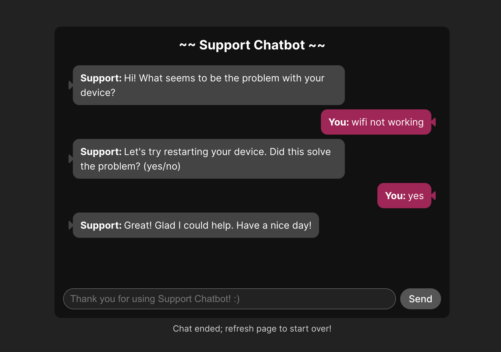
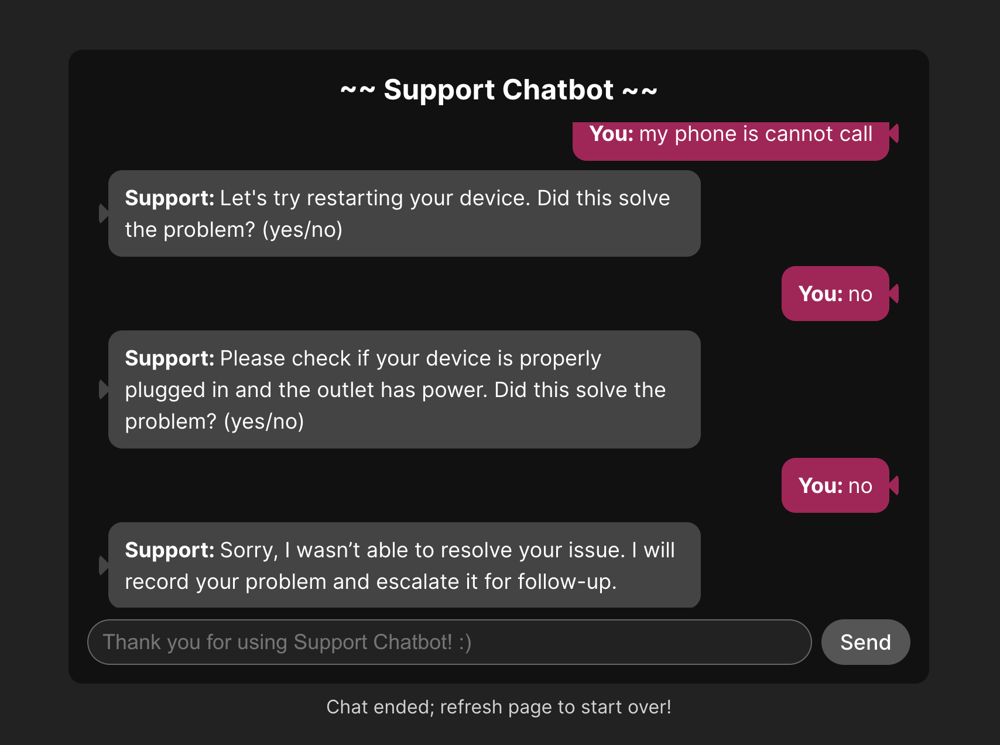
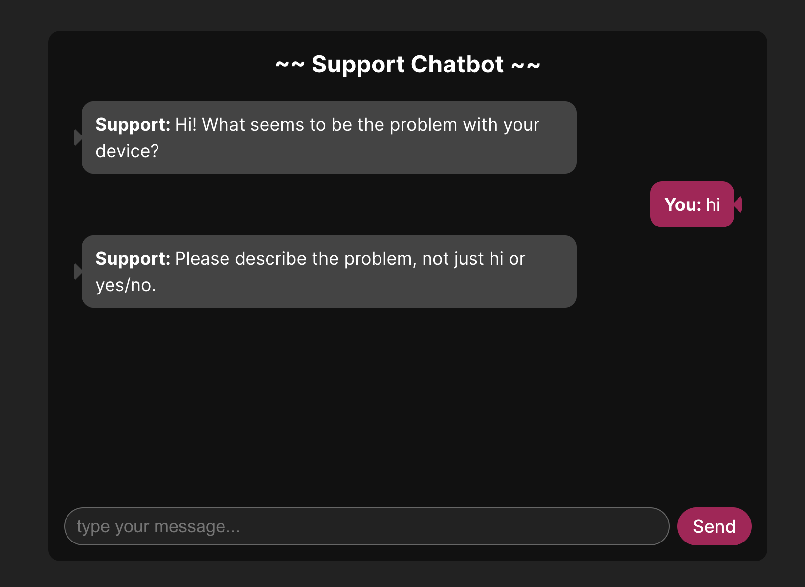
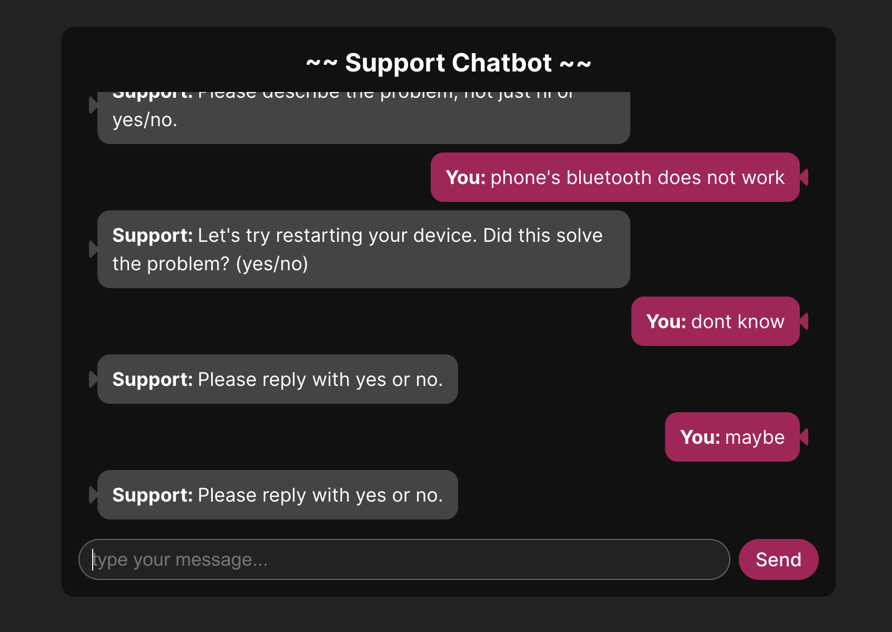

# Support Chatbot Prototype

This project was built for the **SWE Take-Home Assignment** by Cecilia Zhang.  
Scenario: **Guiding a customer through a simple technical troubleshooting process**.

---

## Live Demo

[Try it here!](https://chatbot-prototype-lyart.vercel.app/)

---

## Screenshots

**Example 1 — Restart suggestion**  


**Example 2 — Escalation path**  


**Error Handling 1 — No description**


**Error Handling 2 — Not asnwering yes or no**


---

## Setup / Installation

```bash
git clone https://github.com/CeciliaZhang6/chatbot-prototype.git
cd chatbot-prototype
npm install
npm run dev
```

Open [local host](http://localhost:517) in your browser.

---

## Dev Log

For more details, please check [dev log](https://github.com/CeciliaZhang6/chatbot-prototype/blob/main/dev-log.md).
